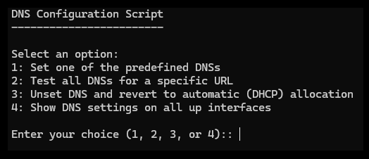
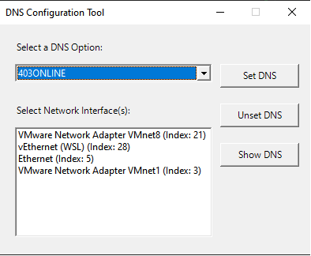

# DNS_Changer
A tool to change and manage DNS settings on Windows, with the ability to view current DNS configurations for each network interface.

## Available DNS Servers:
- SHEKAN     
- 403 ONLINE  
- ELECTRO    
- BEGZAR     
- RADAR      
- SHELTER    
- BESHKAN    
- PISHGAMAN  
- SHATEL     
- LEVEL3     
- CLOUDFLARE 

## Command Line Interface (CLI)
To use the CLI version, run `cli.ps1` in PowerShell with administrator privileges.

## Graphical User Interface (GUI)

To use the graphical interface, you have two options:

1. Run `app.ps1` in PowerShell with administrator privileges.

2. Download the standalone executable from the latest release:
   [Download DNSC.exe](https://github.com/myadegari/DNS_Changer/releases/download/latest/DNSC.exe)

Note: Make sure to run the application with administrator privileges for proper functionality.
